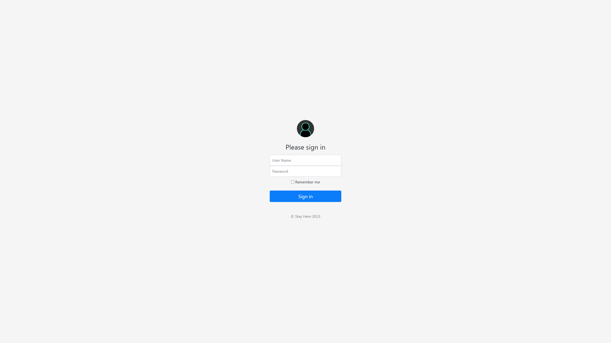

## Dynamic Blogging Website Template with Flask

This project is a Flask-based template for a dynamic blogging website. It supports:

* **Customization:** Administrators can configure the website's theme, navigation, branding, and features.
* **Authoring:** Authors can create, edit, and delete blog posts, manage images, and submit feedback.
* **Reading:** Readers can browse published posts, view images, and leave comments.
* **Authentication:** A login page with user roles (admin and author) restricts access to certain features.
* **Database storage:** All post data, images, and comments are stored in a database for persistence.

### Getting Started

1. **Dependencies:** Install required Python libraries (listed in `requirements.txt`).
2. **Setup:** Configure database connection details in `app/config.py`.
3. **Run the app:** Launch the server with `python app.py`.
4. **Sample Database entries:** [staythere.sql](staythere.sql) will create tables and add sample data.
5. **Install Rquirementens:** ```pip install -r requirements.txt```

### Features

* **Post Management:**
    * Create, edit, and delete blog posts with rich text formatting.
    * Upload and manage images associated with posts.
    * Schedule post publication date and time.
* **User Management:**
    * Secure login with different user roles (admin).
    * Admins can configure website settings and manage users.
* **Reader Experience:**
    * Clean and responsive blog layout for browsing posts.
    * Pagination for navigating through post lists.
    * Comment system for reader interaction.
* **Feedback and Support:**
    * Contact form for users to send feedback and report issues.

### Customization

* Modify website theme and layout with custom CSS and templates.
* Implement additional features or integrations using Flask extensions.
* Configure user roles and permissions for granular access control.


**Snapshots**

* HOME


* ABOUT


* POST


* CONTACT


* DASHBOARD


* ACTIONS


* ADD post


* EDIT existing


